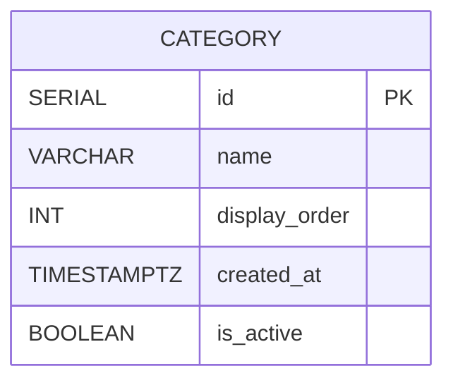

# Category 테이블

## 구조

```mermaid
erDiagram
    CATEGORY {
        SERIAL id PK
        VARCHAR name
        INT display_order
        TIMESTAMPTZ created_at
        BOOLEAN is_active
    }
```

## 컬럼 설명

- `name`: 카테고리 이름 (ex. 디지털/가전 등)
- `display_order`: 노출 순서, 기본값 0
- `is_active`: 카테고리 활성화 여부
- `created_at`: 생성 시각
