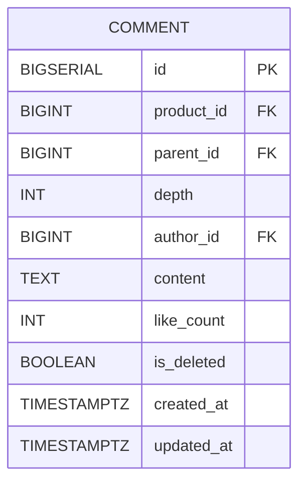

# Comment 테이블

## 구조

## 컬럼 설명

- depth: 댓글 스레드 계층번호
- content: 댓글내용
- like_count: 댓글에대한 좋아요 갯수
- is_deleted: 댓글삭제 여부
- created_at: 댓글생성 시각
- updated_at: 댓글수정 시각

FK:

- `product_id` → `product.id` (상품테이블 참조)
- `parent_id` → `comment.id` (자기자신 self 참조)
- `author_id` → `user.id` (유저테이블 참조)
