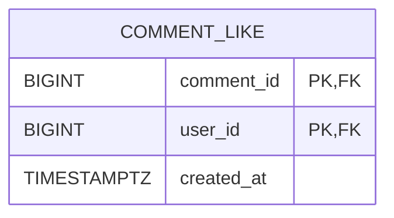

# Comment_like 테이블

## 구조

```mermaid
erDiagram
    COMMENT_LIKE {
        BIGINT comment_id PK, FK
        BIGINT user_id PK, FK
        TIMESTAMPTZ created_at
    }
```

## 컬럼 설명

`created_at`: 좋아요 생성 시각.

복합 PK:

- `comment_id + user_id`

FK:

- `comment_id` → `comment.id`
- `user_id` → `user.id`
