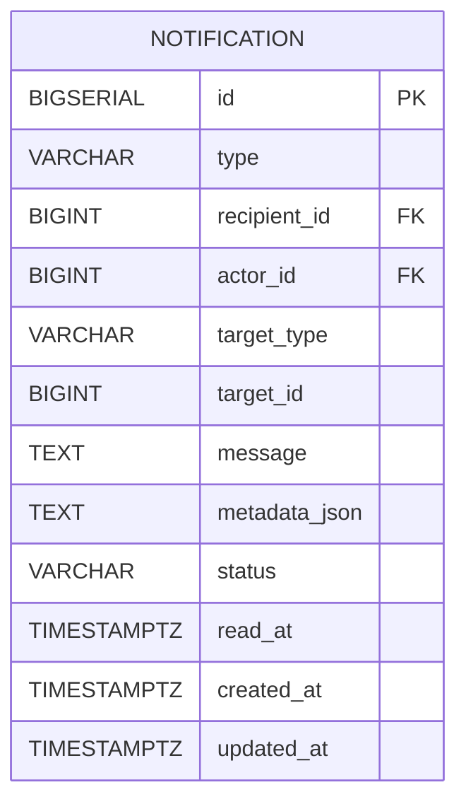

# Notification 테이블

MQ 연동 알람 테이블

## 구조

## 컬럼 설명

- type
    - COMMENT_NEW (댓글 알림)
    - ADMIN_MANAGER_SIGNUP (관리자 승인 알림)
    - REPORT_ACTION (신고처리 결과)

- actor_id: 알림을 발생시킨 주체

- target_type: 알림의 대상 엔티티
    - PRODUCT (상품)
    - COMMENT (댓글)
    - USER (유저)
    - REPORT (신고)

- target_id : target_type으로 지정한 대상의 id

- message: 알림 메시지 내용

- status: 알림 처리 상태
    - CREATED(MQ 메시지 발행)
    - READ (MQ 메시지 소비)

- read_at: 사용자가 알림을 읽은 시각
- created_at: 알림 MQ 발행시각
- updated_at: 알림 MQ 업데이트된 시각 (읽음 상태로 변경시 Date.Now() 적용)

- FK:
    - `recipient_id` → `user.id` : 수신자 id (사용자 테이블 참조)
    - `actor_id` → `user.id` : 발행자 id (사용자 테이블 참조)
