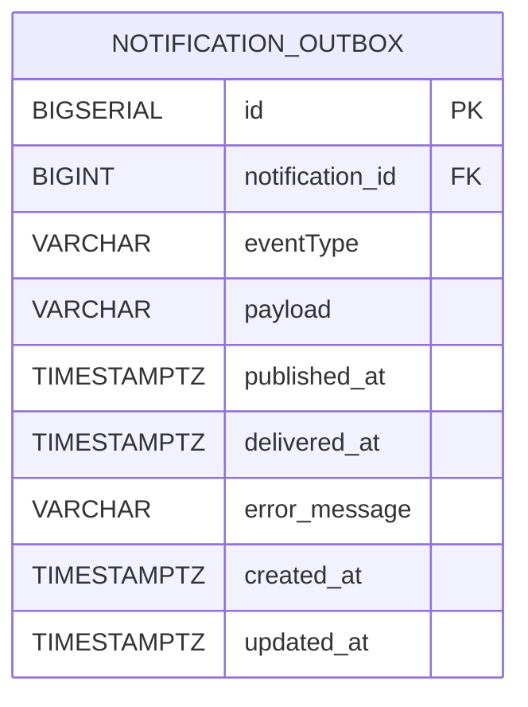

# Notification_outbox 테이블

Message Queue 사용시 메시지 분실을 대비하기 위해 사용하는 테이블

## 구조

## 컬럼 설명

- eventType: 알람 타입
    - COMMENT_NEW (새 댓글 알림)
    - ADMIN_MANAGER_SIGNUP (어드민 가입요청 알림)

- payload: JSON 형태의 원문 notification 정보 (장애 복구시 사용)
- published_at: outbox 메시지의 MQ 발행 시각 ( = 알림의 CRAETED과 유사)
- delivered_at: outbox 메시지 MQ 소비 시각 ( = 알림의 READ와 유사)
- error_message: MQ 발행 및 소비 실패 메시지

- FK
    - `notification_id` → `notification.id`. (알람 테이블 참조)
