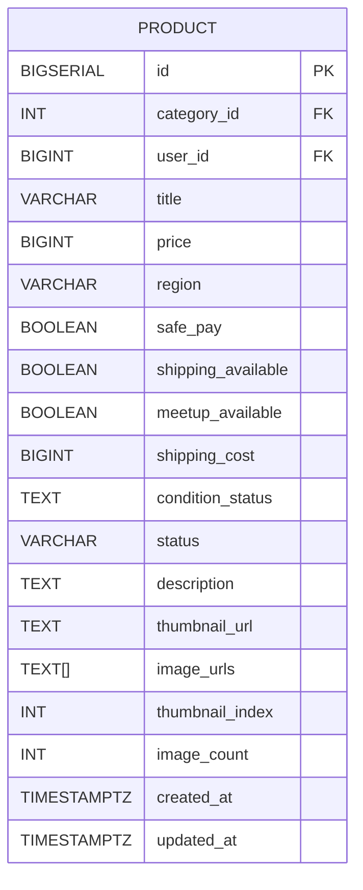

# Product 테이블

## 구조

## 컬럼 설명

- title: 상품(게시글) 명
- price: 상품가격
- region: 거래지역
- safe_pay: 안심거래 사용여부
- shipping_available: 배송거래 가능여부
- meetup_available: 직접거래 가능여부
- shipping_cost: 배송비
- condition_status: 상품상태
    - 중고상품
    - 새상품

- description: 상품설명
- thumbnail_url: 썸네일 이미지 주소
- image_urls: 상품 이미지 배열
- image_count: 등록된 상품 이미지 갯수
- created_at: 작성 시각
- updated_at: 수정 시각

- FK:
    - `category_id` → `category.id` (카테고리 테이블 참조)
    - `user_id` → `user.id` (유저 테이블 참조)
