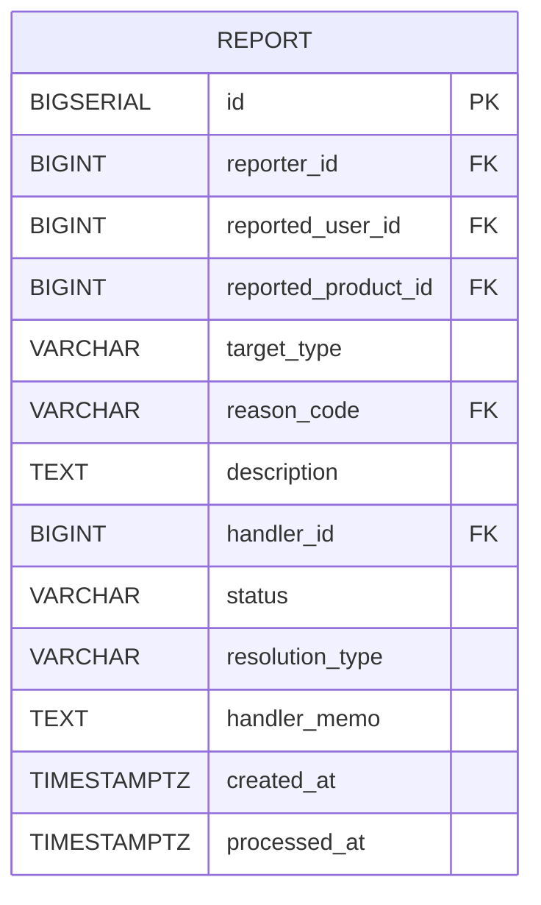

# Report 테이블

## 구조

## 컬럼 설명

- target_type: 신고대상 (상품 / 유저)
- description: 신고내용
- status: 신고처리 상태
    - PENDING(대기),
    - IN_PROGRESS(처리중),
    - RESOLVED(처리완료)

- resolution_type: 신고처리 타입
    - NO_ACTION(조치 없음)
    - WARNED(경고조치)
    - SUSPENDED_USER(계정 정지)
    - BLOCKED_PRODUCT(상품 차단)
    - OTHER (기타)

- handler_memo : 관리자 처리 내용
- created_at : 신고 시각
- processed_at: 관리자 처리 시각

- FK:
    - `reporter_id` → `user.id` (유저테이블 참조) 신고자 id
    - `reported_user_id` → `user.id` (유저테이블 참조) 피신고자 id
    - `handler_id` → `user.id` (유저테이블 참조) 신고처리 담당 매니저
    - `reported_product_id` → `product.id` (상품테이블 참조) 피신고 상품
    - `reason_code` → `report_reason.code` (신고사유 테이블 참조) 신고사유코드
