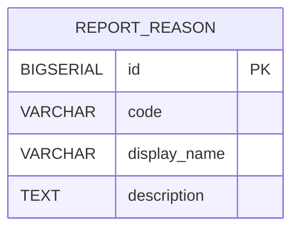

# Report_reason 테이블

## 구조

```mermaid
erDiagram
    REPORT_REASON {
        BIGSERIAL id PK
        VARCHAR code
        VARCHAR display_name
        TEXT description
    }
```

## 컬럼 설명

- `code`: 신고사유 고유 코드
    - SPAM: (스팸, 도배)
    - FRAUD (사기)
    - ABUSE (욕설/혐오)
    - ADULT (성인/음란)

- `display_name`: 코드 별 노출되는 이름
- `description`: 신고 내용
