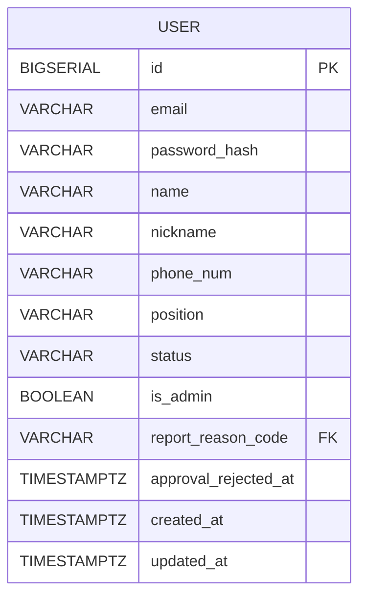

# User 테이블

## 구조

## 컬럼 설명

- email : 유저 이메일 주소
- password_hash: 암호화된 유저 비밀번호
- name: 실명
- nickname: 닉네임
- phone_num: 휴대폰번호 (어드민 관리자만 해당)
- position: 관리자 등급
    - 최고관리자
    - 매니저

- status: 계정 활성상태
    - ACTIVE (활성)
    - PENDING_APPROVAL (승인대기)
    - APPROVAL_REJECTED (승인거절)
    - SUSPENDED (정지)
    - WITHDRAWN (탈퇴)

- is_admin : 어드민 여부

- report_reason_code : 유저 신고사유 코드

- FK: `report_reason_code` → `report_reason.code`.
